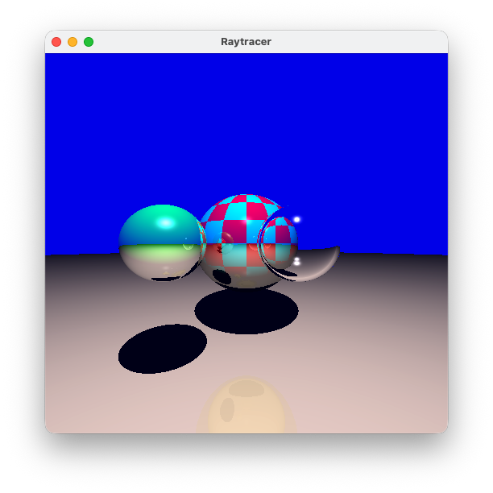
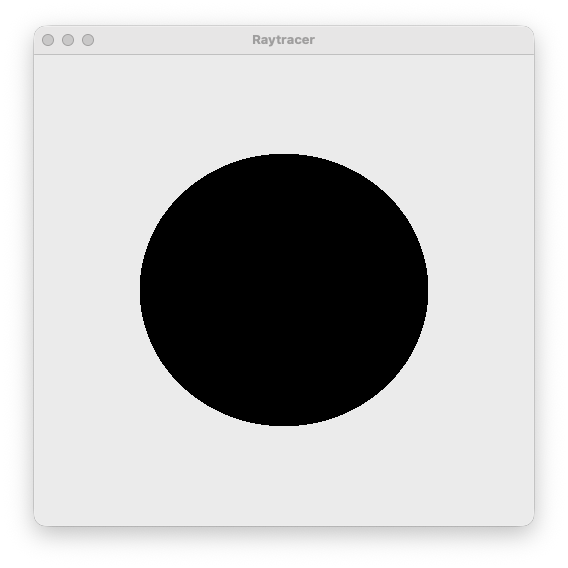
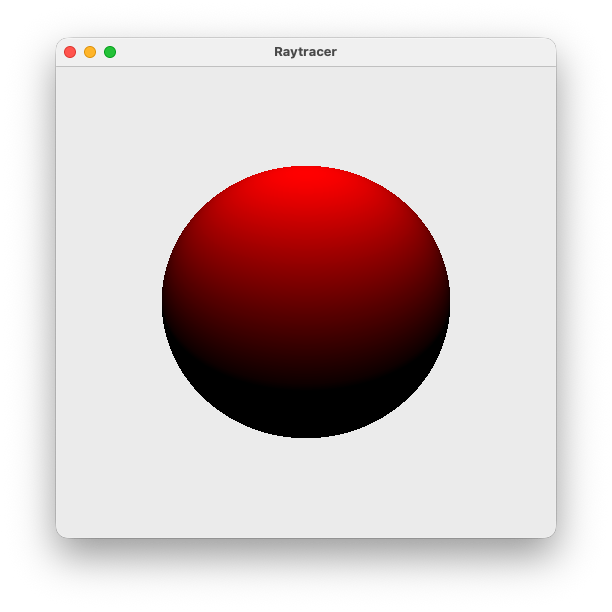
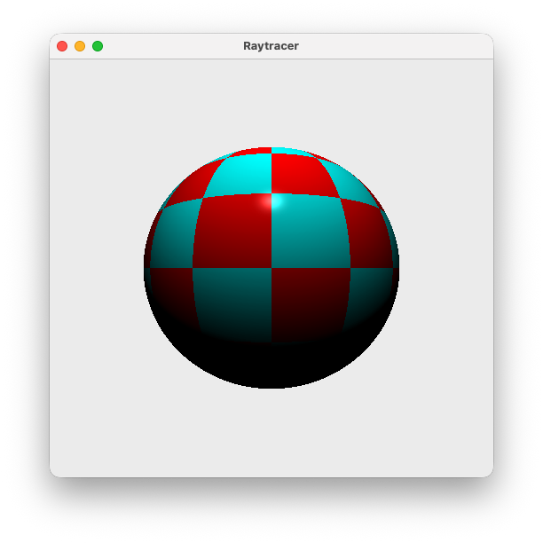
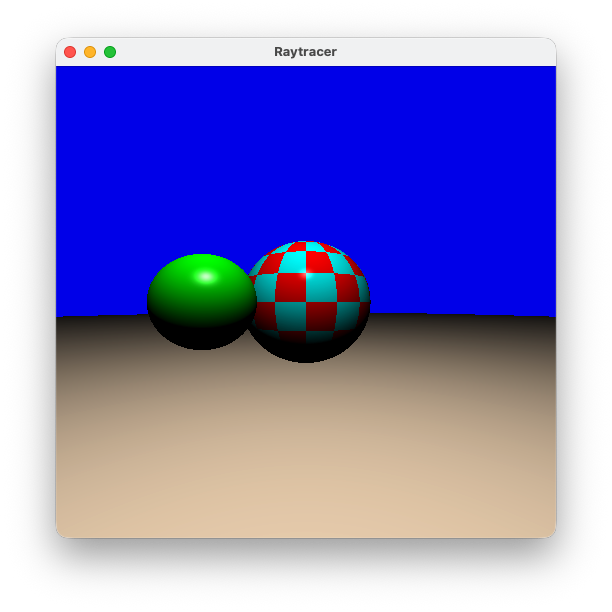
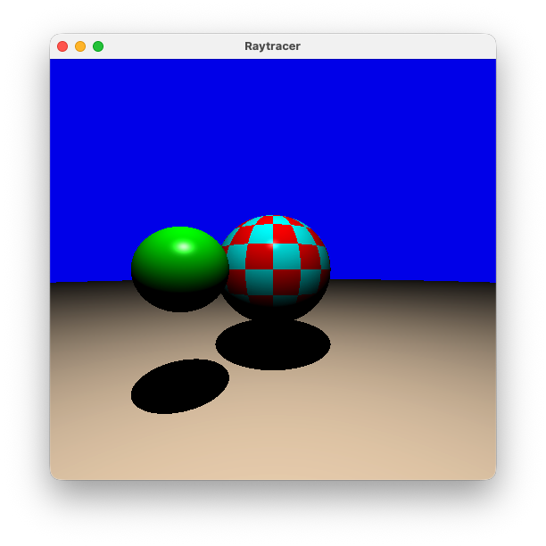
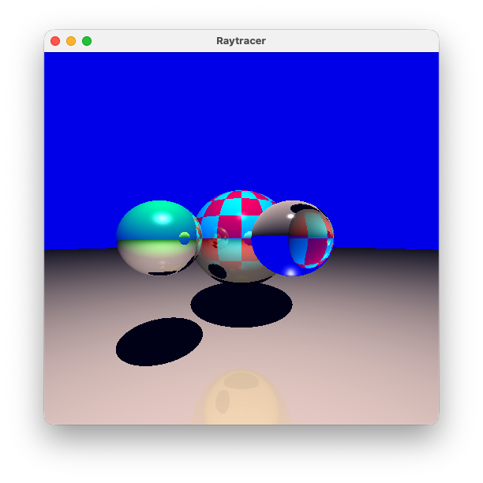

# Raytracer
This project is a basic recursive raytracer implemented in Java using Swing for visualization. It renders a 3D scene by casting rays from a virtual camera into the scene and computing the color of each pixel based on object intersections and a basic point light.



## Features
- Ray-sphere intersection
- Diffuse and specular shading 
- Shadows 
- Recursive reflections 
- Refraction with transparent materials 
- Simple scene setup with multiple spheres and materials

## How it works
For each pixel, a primary ray is shot out from the camera into the scene. The raytracer:
1.	Finds the closest object intersection
2.	Computes shading
3.	Recursively traces reflection and refraction rays
4.	Combines all contributions into a final color

The recursion depth limits how many times rays are reflected or refracted.

## Running the Project
The project is using Maven as a build system and was created using the IntelliJ IDEA IDE.

1. Run ```mvn package``` in the root directory of the project.
2. A .jar file is created in the target-directory. 
3. Start the .jar file with ```java -jar /target/snapshot.jar``` (filename needs to be replaced)

A window will open and render the scene pixel by pixel.

## Notes
- In the test folder you can find some test classes to verify the methods of the classes are working as intended.

## Test Renderings of the different features

### 1. Visibility


### 2. Diffuse Lighting


### 3. Diffuse and Specular Lighting


### 4. Checkerboard Texture


### 5. Multiple Objects


### 6. Shadows


### 7. Recursive Raytracing Depth = 2


### 8. Recursive Raytracing Depth = 5


### 9. Transparent solid Sphere


### 10. Transparent hollow Sphere
